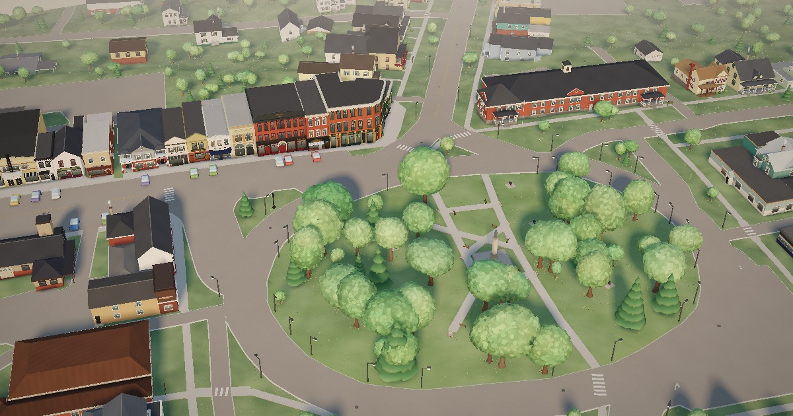

# tiny-town

tiny-town turns a real place into a small, soft, isometric 3D miniature and
serves it in a browser. Give it a centre and a size; it fetches OpenStreetMap
footprints and roads, USGS terrain and aerial imagery, builds a scene, and
renders it in Three.js in the spirit of Tiny Glade. A bounded model-authoring
pipeline then turns Street View photographs of each building into a blueprint
so the miniature is recognisably *that* town. Everything is one Python package
(`tinytown/`) behind one CLI, `./town`.

Live: **[avon.town](https://avon.town)** (Avon, New York, 3.3 × 3.6 km, 1,644
structures) and **[chautauqua.town](https://chautauqua.town)**
(Chautauqua Institution, 946 structures).



## Quickstart

```sh
git clone https://github.com/koomen/tinytown && cd tinytown
python3 -m venv .venv && .venv/bin/pip install -e .   # Python 3.10+
./town serve
# open http://localhost:8734/  (Avon), /avon (alias), /chautauqua, /?site=<name>
```

`town serve` needs only the standard library; `./town` picks up `.venv`
automatically (`pip install -e .` also puts a `town` command on your PATH, and
`python3 -m tinytown …` always works). The viewer loads Three.js from a CDN,
so it needs network access.

For an interactive source-editing queue, run `./town changes serve --workers 2`
and open the printed dashboard URL. Independent Codex workers prepare changes
in isolated snapshots; review the live preview, give feedback, and approve
before changes reach your checkout. Requires a logged-in Codex CLI.
See [the change queue guide](docs/changes.md).

## Make your own town

```sh
./town browser setup                                              # private headless Chromium (once)
./town fetch mytown --center 42.91201,-77.74548 --size 400,400 --title "My Town"
./town build mytown                                               # -> data/mytown/site.json; view at /?site=mytown
./town scope mytown --bounds S,W,N,E                              # optional: freeze which structures are in
./town refs mytown --all                                          # Street View fronts and aerials per building
./town author mytown --all --accept                               # model authoring: needs the Codex CLI (`codex login`)
./town bake mytown                                                # terrain/pavement surfaces and streaming chunks
./town stage --target avon                                       # after adding sites/mytown/site.json
```

Each verb is idempotent: re-running it does the missing work and exits 0.
`./town --help` and `./town <verb> --help` list every flag. The walkthrough is
[docs/pipeline.md](docs/pipeline.md); the authoring policy is
[docs/authoring.md](docs/authoring.md); when something looks wrong, see
[docs/fixing.md](docs/fixing.md).

Prerequisites, by stage: Python ≥ 3.10 with `pillow` and `websocket-client`
(installed by `pip install -e .`); Node ≥ 22 for `bake` and tests; the private
headless Chromium from `./town browser setup` for `refs`, `render`, `author`,
`bake` and browser tests; the [OpenAI Codex CLI](https://github.com/openai/codex)
logged in for `author` and change-queue workers; network for OSM/USGS/Esri fetches, Street View
capture and the Three.js CDN.

## The look

A pale sky dome lights the scene alongside one warm, low sun with soft VSM
shadows; GTAO, tilt-shift depth of field, bloom, ACES and a split-tone grade
finish the frame. Materials are procedural (brick, stone, siding, shingles)
with a faint world-space grain so flat vertex colour reads as plaster, asphalt
or turf. Trees are gently lobed canopies wearing hundreds of small leaf dabs
that light as one soft ball. Roads are coloured by where they are, never by
which ribbon is drawn, so junctions paint alike. Terrain, roads and sidewalks
share one piecewise-planar grade; buildings meet their real frontages. A
day/night toggle swaps the lighting in place, and large maps stream detail by
camera sector within fixed memory budgets. Details, streaming budgets and every
viewer URL parameter: [docs/rendering.md](docs/rendering.md).

## Repository map

```
town                 CLI shim: python -m tinytown "$@" (prefers .venv/)
pyproject.toml       package metadata; `pip install -e .` installs `town`
tinytown/            the package, one module per stage: sources, site, references,
                     review, render, author, model, bake, deploy, browser, state, config, paths
  plugins/           per-site hooks (avon.py, chautauqua.py)
  web/               pages and scripts the pipeline drives in the browser (bake, stream export)
index.html, src/     the viewer (Three.js modules, served as-is)
sites/<site>/        site config: site.json (title, deploy routes, plugin), scope, labels, landmarks
sites/deploy.json    deploy targets -> dist directory and Wrangler config
data/<site>/         the miniature: source/, overrides.json, site.json, surfaces*, stream/, buildings/<id>/
tests/               unit/ (python unittest), node/ (node --test), browser/ (headless drivers), run.sh
docs/                ARCHITECTURE.md (the contract) and the guides below
wrangler*.jsonc, _headers   Cloudflare Workers
CLAUDE.md            notes for coding agents
```

Docs: [ARCHITECTURE.md](docs/ARCHITECTURE.md) · [pipeline.md](docs/pipeline.md) ·
[data-format.md](docs/data-format.md) · [authoring.md](docs/authoring.md) ·
[fixing.md](docs/fixing.md) · [rendering.md](docs/rendering.md) · [changes.md](docs/changes.md) ·
[deploy.md](docs/deploy.md) · [landmarks.md](docs/landmarks.md) ·
[chautauqua.md](docs/chautauqua.md) · [BLUEPRINT_SCHEMA.md](docs/BLUEPRINT_SCHEMA.md) ·
[STYLE_SCHEMA.md](docs/STYLE_SCHEMA.md) · [MINIATURE_KIT.md](docs/MINIATURE_KIT.md)

## Tests

```sh
tests/run.sh
```

Runs the Python unit tests (`tests/unit`, no network or model), the Node tests
(`tests/node`) and, when the private browser is installed, the headless viewer
suite (`node tests/browser/run.mjs`; `--list` names the other drivers, `all`
runs them). See [CLAUDE.md](CLAUDE.md) for what each tier needs.

## Deployment

Two Cloudflare Workers upload the static `dist/` directories that
`./town stage` stages: `avon-town` serves avon.town (`/` Avon, `/avon` alias,
`/avon-extended`, `/chautauqua`) and `chautauqua-miniature` serves
chautauqua.town. Routes derive from `sites/*/site.json`. On push to `main`,
Workers Builds runs `python3 -m tinytown stage --target …` with bare Python
and Node; it only checks that the committed surfaces, streams and viewer stamps
are current, so bake before you push. Verify with
`./town verify town https://avon.town`. Details: [docs/deploy.md](docs/deploy.md).

## Credits and attribution

- Map data © [OpenStreetMap](https://www.openstreetmap.org/copyright)
  contributors, via the Overpass API (ODbL 1.0).
- Elevation: U.S. Geological Survey, [3D Elevation Program](https://www.usgs.gov/3dep)
  (public domain).
- Aerial imagery from Esri World Imagery, Google Street View panoramas and
  web photographs are used locally as reference for authoring only. They are
  gitignored, never committed and never deployed.
- [Three.js](https://threejs.org) (MIT) from jsDelivr; fonts Nunito and
  Fraunces from Google Fonts (SIL Open Font License).
- Authoring uses the OpenAI Codex CLI; model names and aliases are in
  `tinytown/model.py`.

The miniatures depict real places, including real signage and business names,
as hand-made caricatures. Signs are redrawn or procedural approximations, not
brand artwork, and the project is not affiliated with or endorsed by any
business or institution shown.

## License

Code is released under the MIT License (see [LICENSE](LICENSE)). The committed
derived data under `data/` (`site.json`, `overrides.json`, `surfaces*.bin.gz`,
`stream/`) is derived from OpenStreetMap and is available under the
[Open Database License 1.0](https://opendatacommons.org/licenses/odbl/1-0/)
with the attribution "© OpenStreetMap contributors".
